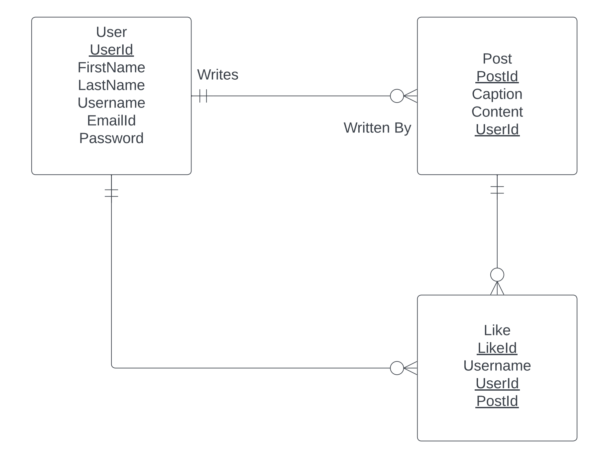

# Rite up

Introducing Rite-Up, a unique social media platform where you can share your stories through written posts. Connect and engage with others creatively!

## ER Diagram



---
# Getting Started

## Prerequisites

Ensure you have the following installed on your machine: 
* [NodeJS](https://nodejs.org/)
* [Git](https://git-scm.com/)
* [MySQL](https://www.mysql.com/) 
## Setup

1. Clone the repository to your local machine using:
    ```bash
    git clone https://github.com/sravanipamarthi/rite-up
    ```

2. Create a [.env](./.env) file with following values
    ```SQL
    MYSQL_HOST="<YOUR_MYSQL_HOST>"
    MYSQL_USERNAME="<YOUR_MYSQL_Username>"
    MYSQL_PSWD="<YOUR_MYSQL_Password>"
    MYSQL_DB="<YOUR_MYSQL_Database>"
    MYSQL_PORT="<YOUR_MYSQL_PORT>"
    ```

3. run `npm i` to install the required dependencies
    ```bash
    npm i
    ```

4. Start the application by running:
    ```bash
    npm run dev
    ```

5. Open [localhost:3000](http://localhost:3000/) in your browser to use the application.


\
**Note:** Make sure to replace the placeholder values in the `.env` file with your actual MySQL database credentials.

---
### Copyright
© Sravani Pamarthi | All Rights Reserved
